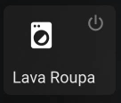

# NeumorphicCustomButtonCard
Neumorphism (or Neo-skeuomorphism) is a modern iteration of a style of designing web elements, frames, screens, etc. So, why not using it on Home Assistant Lovelace Cards? Basically I use the extra_styles and animation properties of the custom button card to make this happen.

## Before start

What do I need?

- [Home Assistant](https://www.home-assistant.io/) using [HACS](https://hacs.xyz/) and installed:
  - [Card-mod](https://github.com/thomasloven/lovelace-card-mod) - to create our fancy card buttons on lovelace dashboard
  - [Custom Button Card](https://github.com/custom-cards/button-card) - to style our card buttons on lovelace dashboard

I will consider that you know how to use custom button card in an advanced way.
So, thats it! If you like it just add me here and give some ⭐ to this project.

## Shaking style



When my old washing machine starts it shakes a lot. Let's do it on lovelace.

```yaml
        type: custom:button-card
        entity: input_select.state_washingmachine
        name: Lava Roupa
        show_label: true
        show_state: false
        extra_styles: "@keyframes vibrate-2 {\n0% {\n-webkit-transform: translate(0);\n transform: translate(0);\n}\n20% {\n
        -webkit-transform: translate(2px, -2px);\n transform: translate(2px, -2px);\n}\n40% {\n-webkit-transform: translate(2px,
        2px);\n transform: translate(2px, 2px);\n}\n60% {\n -webkit-transform: translate(-2px, 2px);\n transform:
        translate(-2px, 2px);\n }\n80% {\n -webkit-transform: translate(-2px, -2px);\n transform: translate(-2px, -2px);\n
        }\n100% {\n-webkit-transform: translate(0);\n transform: translate(0);\n }\n}\n@keyframes heartbeat {\n from {\n
        -webkit-transform: scale(1);\n transform: scale(1);\n -webkit-transform-origin: center center;\n transform-origin:
        center center;\n -webkit-animation-timing-function: ease-out;\n animation-timing-function: ease-out;\n }\n 10% {\n
        -webkit-transform: scale(0.91);\n transform: scale(0.91);\n -webkit-animation-timing-function: ease-in;\n
        animation-timing-function: ease-in;\n }\n 17% {\n -webkit-transform: scale(0.98);\n transform: scale(0.98);\n
        -webkit-animation-timing-function: ease-out;\n animation-timing-function: ease-out;\n }\n 33% {\n -webkit-transform:
        scale(0.87);\n transform: scale(0.87);\n -webkit-animation-timing-function: ease-in;\n animation-timing-function:
        ease-in;\n }\n 45% {\n -webkit-transform: scale(1);\n transform: scale(1);\n -webkit-animation-timing-function:
        ease-out;\n animation-timing-function: ease-out;\n }\n}\t\t\t\n"
        label: >-
        [[[ if (entity.state == 'off') return '<ha-icon icon="mdi:power"></ha-icon>'; if (entity.state == 'switched-off')
        return
        '<ha-icon icon="mdi:power-plug-off"></ha-icon>'; else return '<ha-icon icon="mdi:water"></ha-icon>'; ]]]
        styles:
        card:
        - height: 100px
        - width: 126px
        grid:
        - grid-template-areas: '"i" "n" "s" "l"'
        - grid-template-columns: 1fr
        - grid-template-rows: 1fr min-content
        img_cell:
        - align-self: start
        - text-align: start
        label:
        - justify-self: end
        - width: 25px
        - font-size: 15px
        - margin-top: '-150px'
        - margin-right: 10px
        name:
        - justify-self: start
        - padding-left: 10px
        - font-size: 18px
        - margin-bottom: 4px
        state:
        - justify-self: start
        - padding-left: 10px
        - font-size: 15px
        - margin-bottom: 4px
        icon:
        - width: 35px
        - color: white
        - margin-left: '-37px'
        - margin-top: '-10px'
        - animation: |
        [[[
        if (entity.state == 'Washing') return 'vibrate-2 0.3s linear infinite both';
        ]]]
```

## Pulse style


When my radiators start to heat I like to show a pulse effect like a fireplace.

